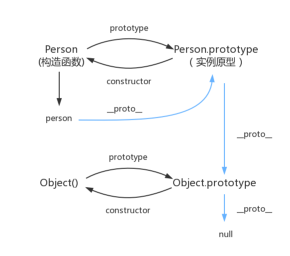

```
function Person() {}
Person.prototype.name = 'Kevin';
const person1 = new Person();
const person2 = new Person();
console.log(person1.name === person2.name);
// 每一个函数都有一个prototype，他就是实列。
而每一个对象都具有一个属性_proto_,他会指向改对象的原型。
原型的constructor指向函数
console.log(person._proto_ === Person.prototype)
console.log(Person.prototype.constructor == Person)
// es5方法获取对象的原型
console.log(Object.getPrototypeOf(person) === Person.prototype)

构造函数有一个对象实列，对象实列有_proto_指向实列原型，原型和构造函数之间。函数prototype指向实列，实列原型constructor指向构造函数。
```



在js中，所有对象都有一个特殊的属性__proto__指向该对象的原型对象，当调用对象的属性方法时，会从对象本身查找，如果找不到，就从对象的原型上找，对象的原型也是一个对象，也有自己的原型，如果找不到就会一直向上找直到最顶层的原型为null，找到了就返回对应的属性方法，找不到就报错，这种原型找上层原型形成的链式查找，就叫原型链