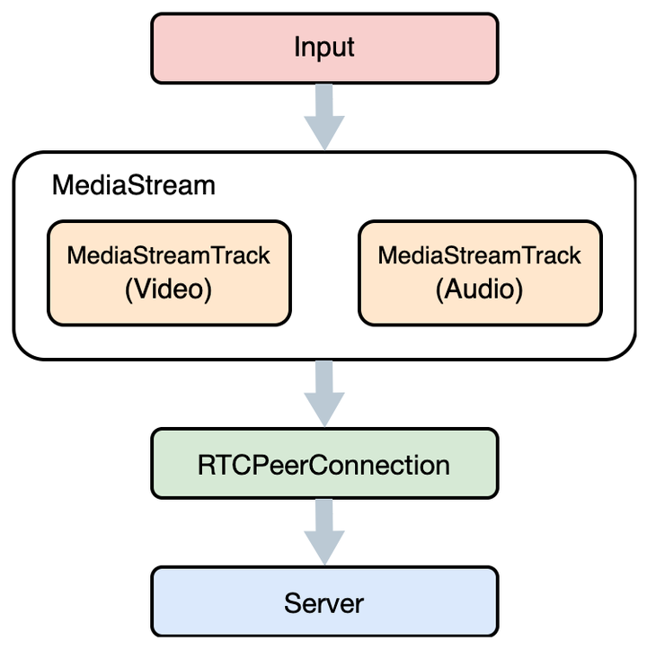
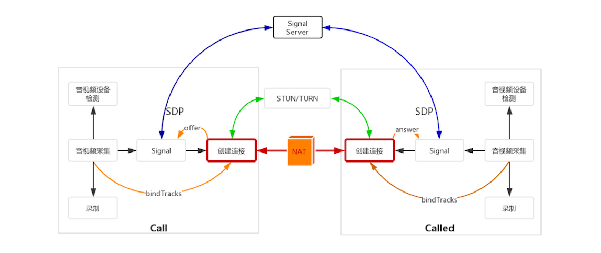
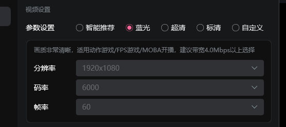

## webrtc 实现推拉流

Web 上实现直播推流的方式主要是 websocket.

### 笔者以直播场景下为例

用在直播的场景下，通过 WebRTC 推流，用户不需要借助 OBS 等推流软件，打开网页就可以发起直播。

推流原理

浏览器将复杂的 WebRTC 功能抽象为三个主要的 API

1. Media Stream, 用来获取音视频流
2. RTCPeerConnection，建立对等连接，用来传输音视频数据；
3. RTCDataChannel，用来传输任意应用数据；
   发起直播推流只需要用到前面两个 API ，首先获取表示音视频流的 MediaStream 对象，然后建立点对点连接 RTCPeerConnection，通过 RTCPeerConnection 将 MediaStream 推送到直播服务器即可。



## 推拉流代码

```推流
 const webrtcUrl = ref(
      "webrtc://live.abc.com/live"
    );

    let rtcPublisher = null; // 用于存储RtcPublisher实例
    let rtcPlayer = null; // 用于存储RtcPlayer实例

    const startPublisher = async () => {
      try {
        rtcPublisher = new Srs.SrsRtcPublisherAsync(); // 创建RtcPublisher实例
        const session = await rtcPublisher.publish(webrtcUrl.value); // 开始推流
        console.log("推流成功", session);
        await nextTick(); // 等待DOM更新，确保pusher是可用的
        // 如果需要，这里可以添加播放器的初始化代码（如果RtcPublisher也提供了流）
      } catch (error) {
        console.error("推流失败", error);
        // 如果RtcPublisher有close方法，调用它以关闭推流
        if (rtcPublisher && rtcPublisher.close) {
          rtcPublisher.close();
        }
      }
    };

    const startPlayer = async () => {
      try {
        rtcPlayer = new Srs.SrsRtcPlayerAsync(); // 创建RtcPlayer实例
        await rtcPlayer.play(webrtcUrl.value); // 开始播放
        await nextTick(); // 等待DOM更新，确保pusher是可用的
        // 设置视频源的srcObject
        if (rtcPlayer.stream && pusher.value) {
          pusher.value.srcObject = rtcPlayer.stream;
        }
      } catch (error) {
        console.error("播放失败", error);
        // 如果RtcPlayer有close或stop方法，调用它以停止播放
        if (rtcPlayer && (rtcPlayer.close || rtcPlayer.stop)) {
          // 假设有一个close或stop方法可用
          rtcPlayer.close?.() || rtcPlayer.stop?.();
        }
      }
    };
    const startPublisherBtn = async () => {
      await startPublisher();
      await startPlayer();
    };
    const stopPublisherBtn = async () => {
      if (rtcPublisher && rtcPublisher.close) {
        rtcPublisher.close();
      }
      if (rtcPlayer && (rtcPlayer.close || rtcPlayer.stop)) {
        rtcPlayer.close?.() || rtcPlayer.stop?.();
      }
    };

    onUnmounted(() => {
      // 组件卸载时关闭推流和播放
      if (rtcPublisher && rtcPublisher.close) {
        rtcPublisher.close();
      }
      if (rtcPlayer && (rtcPlayer.close || rtcPlayer.stop)) {
        rtcPlayer.close?.() || rtcPlayer.stop?.();
      }
    });
```

```拉流
import FlvPlugin from 'xgplayer-flv';
import 'xgplayer/dist/index.min.css';

const initPlayer = () => {
  const params = {
    el: domRef.value,
    url: 'https://192.168.3.240/live/livestream.flv ',
    isLive: true,
    height: 600,
    width: 1054,
    plugins: [FlvPlugin]
  };
  playerContainer.value = new Player(params);
};

onMounted(() => {
  initPlayer();
});
```

## webrtc 控制传播速率

### 上面已经实现了直播推拉流

我们现在来说如何控制传播速率，逻辑很简单，就是通过 RTCPeerConnection 进行传输速率的控制。之所以要进行传输速率的控制，是因为它会对音视频服务质量产生比较大的影响



音视频服务质量主要是两方面

- 网络质量，包括物理链路的质量、带宽的大小、传输速率的控制等；
- 数据，包括音视频压缩码率、分辨率大小、帧率等。

1. 物理链路质量
   物理链路质量包括三个方面，即丢包、延迟和抖动。

- 丢包：如果物理链路不好，就会出现丢包。导致接收端无法接收，解码。
- 延迟：指双方在传输数据时，数据在物理链路上的花费的时间。延迟应在 200-500ms、超过会有明显延迟。
- 抖动：指的是数据一会儿快、一会儿慢，很不稳定。不过对于 WebRTC 来讲，它通过内部的 JitterBuffer（可以简单地理解为一块缓冲区）就能很好地解决该问题。



直播效果取决于

1. 带宽大小，带宽大小指的是每秒钟可以传输多少数据。
2. 传输速率-码率
   <br/>
   码率，与传输速率相关的有两个码率：音视频压缩码率和传输控制码率

- 音视频压缩码率指的是单位时间内音视频被压缩后的数据大小，或者你可以简单地理解为压缩后每秒的采样率。它与视频的清晰度是成反比的，也就是压缩码率越高，清晰度越低。
- 传输码率是指对网络传输速度的控制。

3. 分辨率
   <br />
   视频的分辨率越高，视频就越清晰，但同时它的数据量也就越大。我们还是来简单计算一下，对于 1 帧未压缩过的视频帧，如果它的分辨率是 1280 _ 720，存储成 RGB 格式，则这一帧的数据为 1280 _ 720 _ 3 _ 8（3 表示 R、G、B 三种颜色，8 表示将 Byte 换算成 bit），约等于 22Mb；而存成 YUV420P 格式则约等于 11Mb，即 1280 _ 720 _ 1.5 _ 8。
   <br />
   按照上面的公式计算，如果你把视频的分辨率降到 640 _ 360，则这一帧的数据就降到了原来的 1/4，这个效果还是非常明显的。所以，如果你想降低码率，最直接的办法就是降分辨率。

4. 帧率
   <br />
   对帧率的控制也一样可以起到一定的效果。比如原来采集的视频是 30 帧 / 秒，还以分辨率是 1280 _ 720 为例，之前 1 帧的数据是 22M，那 30 帧就是 22 _ 30=660Mb。但如果改为 15 帧 / 秒，则数据就变成了 330Mb，直接减少了一半。
   <br />
   通过减少帧率来控制码率的效果可能并不明显，因为在传输数据之前是要将原始音视频数据进行压缩的，在同一个 GOP（Group Of Picture）中，除了 I/IDR 帧外，B 帧和 P 帧的数据量是非常小的。因此，减少帧率的方式就没有降低分辨率方式效果明显了。

## 修改码率

这种是直推，还有一种是将流绘制到 canvas 上，再把 canvas 推送

```直推
const { resolution, frame, bitrate } = formModel;
  let height = 720;
  let width = 1280;
  if (resolution === 1) {
    width = 1920;
    height = 1080;
  }
  // 重新获取流
  try {
    // 关闭旧流
    if (videoStream.value) {
      videoStream.value.getTracks().forEach((track: { stop: () => any }) => track.stop());
      videoStream.value = null;
    }
    // 重新获取流
    videoStream.value = await navigator.mediaDevices.getUserMedia({
      video: {
        width,
        height,
        frameRate: frame
      },
      audio: true
    });
    if (localVideoRef.value) {
      localVideoRef.value.srcObject = videoStream.value;
    }
    await nextTick();
    // 关闭并重启推流
    if (rtcPublisher && rtcPublisher.close) {
      rtcPublisher.close();
    }
    await startPublisher();
    // 设置码率（部分浏览器支持）
    if (rtcPublisher && rtcPublisher.pc) {
      const sender = rtcPublisher.pc
        .getSenders()
        .find((s: { track: { kind: string } }) => s.track && s.track.kind === 'video');
      if (sender) {
        const params = sender.getParameters();
        if (!params.encodings) params.encodings = [{}];
        params.encodings[0].maxBitrate = bitrate * 1024; // bitrate 单位 kbps
        await sender.setParameters(params);
      }
    }
  } catch (err) {
    console.error('切换清晰度失败', err);
  }

```

```canvas
// 绘制视频帧
ctx = canvas.getContext("2d");
ctx.drawImage(video, 0, 0, 1920, 1080)

ctx = this.$refs.canvasRef.getContext("2d");

const video = document.createElement('video');
video.crossOrigin = 'anonymous';
video.src = TestVideo;
video.muted = true; // 静音才能实现自动播放
video.preload = 'auto';
video.loop = true;

let maxFramerate = 60; // 设置帧率为60
const delay = 1000 / (maxFramerate / (17.68 / 20));
setInterval(() => {
  ctx.drawImage(video, 0, 0, 1920, 1080); //绘制视频
}, delay);
```
